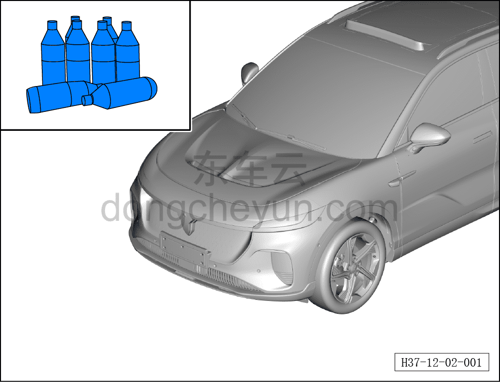
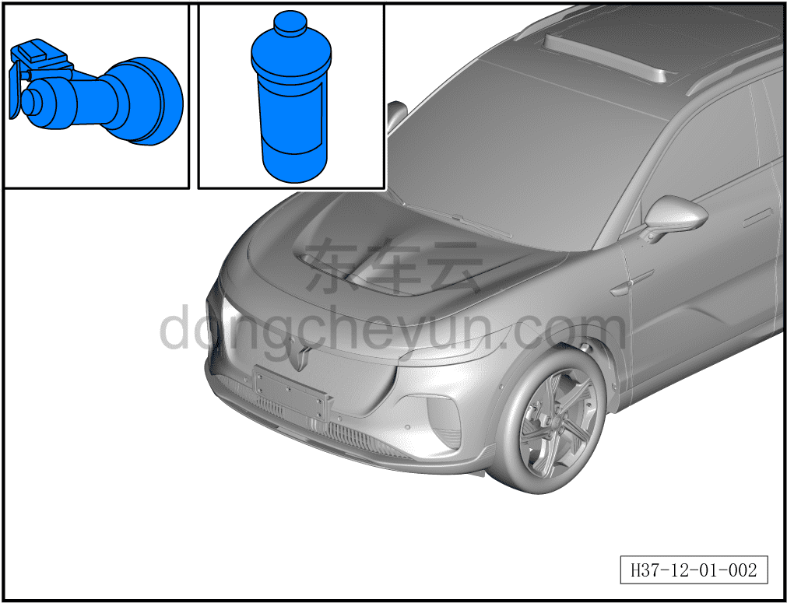

# Пример технологического процесса устранения распространённых дефектов лакокрасочной плёнки

> Кузовные жестяные работы, окраска › Лакокрасочное покрытие › Снятие и установка  
> Оригинал: `常见漆膜缺陷处理工艺过程示例` · [dongcheyun 56746](https://dongcheyun.com/p/56746), страница `ad969708c82f465796831ae035214681` · [оглавление](../README.md)

1. Перед полировкой очистите обрабатываемую поверхность обезжиривающим средством.

2. Сначала тщательно смочите полировальный поролоновый круг, удалите излишки воды, нанесите небольшое количество полировочного воска на обрабатываемую поверхность лакокрасочного покрытия и отрегулируйте скорость полировальной машины.

3. Приложите поролоновый полировальный круг к покрытию, затем включите машину, скорость (2500–3000) об/мин, слегка прижимая (3–5) с выполните полировку.

**Внимание:**

**- При выполнении операции держите машину устойчиво, перемещайте её плавно, категорически избегайте длительной обработки одного участка, чтобы не допустить перегрева и ожога лакокрасочного покрытия.**

4. Удалите излишки полировочного воска протирочной ветошью.
