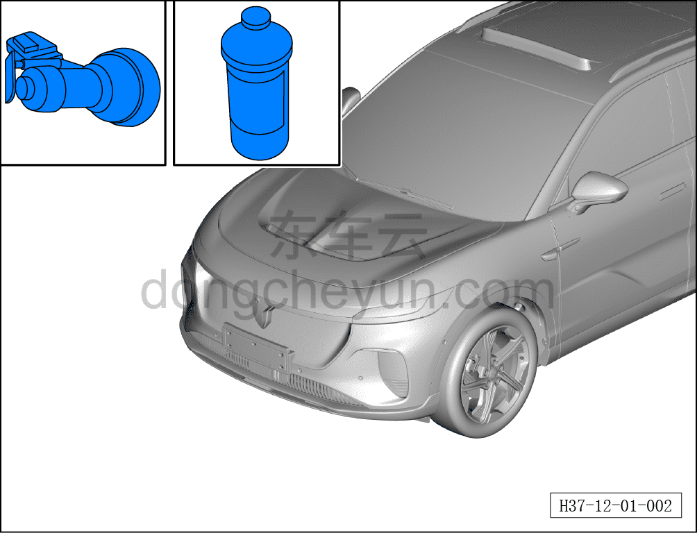

# Пример технологического процесса обычной шлифовально-полировочной косметической обработки

> Кузовные жестяные работы, окраска › Лакокрасочное покрытие › Снятие и установка  
> Оригинал: `常规研磨抛光美容处理工艺过程示例` · [dongcheyun 56746](https://dongcheyun.com/p/56746), страница `125f3a47624a42acb3ed7a65c363ca08` · [оглавление](../README.md)

1. Перед полировкой очистите обрабатываемую поверхность обезжиривающим средством.

2. Нанесите нужное количество полировальной пасты на обрабатываемую поверхность лакокрасочного покрытия, отрегулируйте скорость полировальной машины.

3. Приложите шерстяной полировальный круг к покрытию, затем включите машину, скорость (2500–3000) об/мин.

**Внимание:**

**- Держите машину устойчиво, перемещайте её плавно, категорически избегайте избыточного шлифования. Обеспечьте минимально возможное время шлифования и минимально возможную площадь зоны шлифования.**

4. Сначала тщательно смочите полировальный поролоновый круг, удалите излишки воды; нанесите небольшое количество полировочного воска на обрабатываемую поверхность покрытия, приложите поролоновый полировальный круг к покрытию, затем включите машину, скорость (2500–3000) об/мин, слегка прижимая (3–5) с выполните полировку.

**Внимание:**

**- При выполнении операции держите машину устойчиво, перемещайте её плавно, категорически избегайте длительной обработки одного участка, чтобы не допустить перегрева и ожога лакокрасочного покрытия.**

5. Удалите излишки полировочного воска протирочной ветошью.
