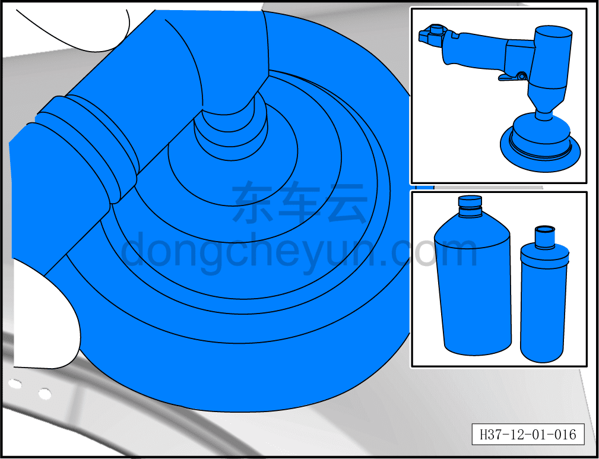
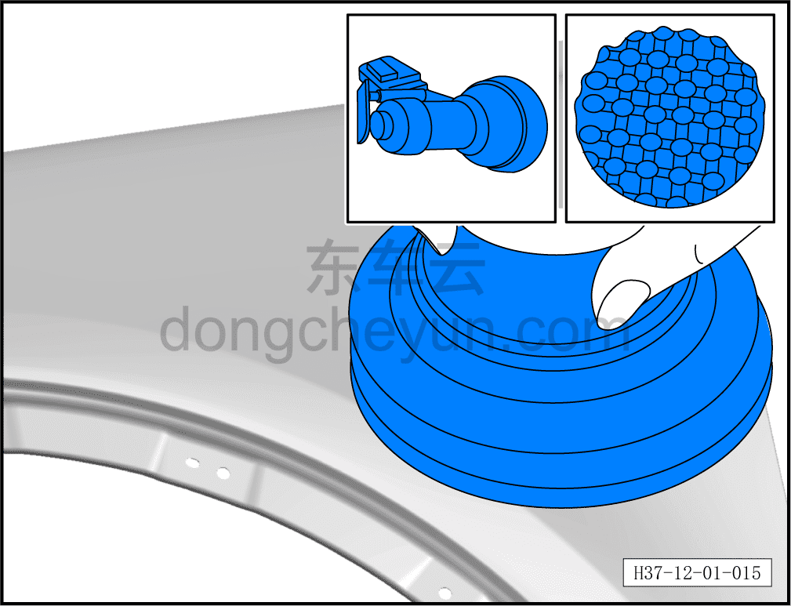
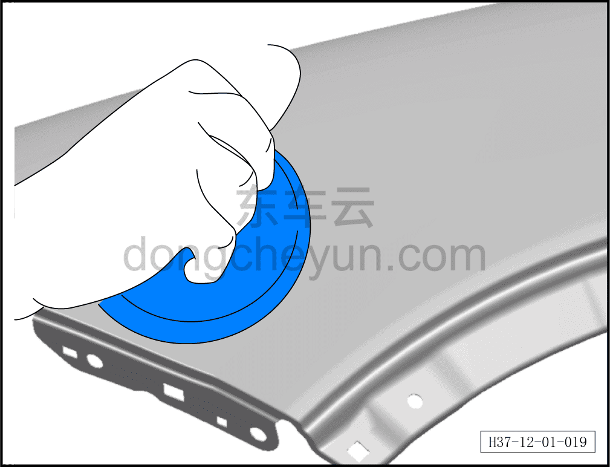
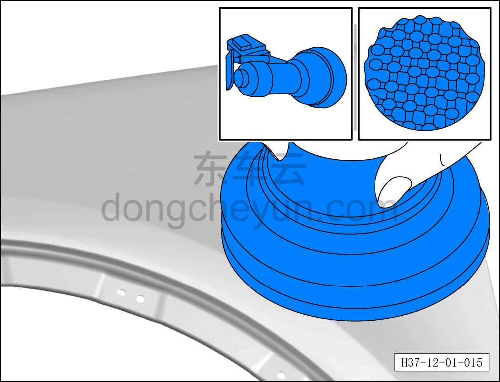

# Пример технологического процесса глубокой шлифовально-полировочной обработки

> Кузовные жестяные работы, окраска › Лакокрасочное покрытие › Снятие и установка  
> Оригинал: `深度研磨抛光处理工艺过程示例` · [dongcheyun 56746](https://dongcheyun.com/p/56746), страница `f4ba9c81193f494fa974234b75903f23` · [оглавление](../README.md)

1. Обработайте повреждённую поверхность лакокрасочного покрытия водостойкой наждачной бумагой №2000, держите её параллельно и плотно прижатой к обрабатываемой поверхности, выполняя круговые шлифовальные движения.

2. Нанесите нужное количество полировальной пасты на обрабатываемую поверхность лакокрасочного покрытия, отрегулируйте скорость полировальной машины.

3. Приложите шерстяной полировальный круг к покрытию, затем включите машину, скорость (2500–3000) об/мин.

**Внимание:**

**- Держите машину устойчиво, перемещайте её плавно, категорически избегайте избыточного шлифования. Обеспечьте минимально возможное время шлифования (3–5) с и минимально возможную площадь зоны шлифования.**

4. Сначала тщательно смочите полировальный поролоновый круг, удалите излишки воды; нанесите небольшое количество полировочного воска на обрабатываемую поверхность покрытия, приложите поролоновый круг к покрытию, затем включите машину, скорость (2500–3000) об/мин. Слегка прижимая (3–5) с выполните полировку.

**Внимание:**

**- При выполнении операции держите машину устойчиво, перемещайте её плавно, категорически избегайте длительной обработки одного участка, чтобы не допустить перегрева и ожога лакокрасочного покрытия.**

5. Удалите излишки полировочного воска протирочной ветошью.
