# Технология окрасочного нанесения на жёсткие поверхности

> Кузовные жестяные работы, окраска › Лакокрасочное покрытие › Снятие и установка  
> Оригинал: `刚性表面的油漆喷涂工艺` · [dongcheyun 56746](https://dongcheyun.com/p/56746), страница `35956ca73bf54d99a0306afdb833f03c` · [оглавление](../README.md)

Ниже на примере крыла описан технологический процесс локальной окраски (подкраса)

**Внимание:**

**- При выполнении окрасочных работ персонал должен надлежащим образом использовать противогазовую маску, перчатки и защитные очки, чтобы снизить риск получения травм.**

**- Весь ремонт лакокрасочного покрытия жёстких поверхностей должен соответствовать стандартам Voyah. Определите зону ремонта и выберите объём ремонта, например, локальный ремонт, ремонт всей детали, ремонт всего автомобиля; при повреждении в результате аварии, в зависимости от степени повреждения, выполните восстановление кузовной панели с последующим соответствующим подкрасом, либо замену детали с последующей окраской.**

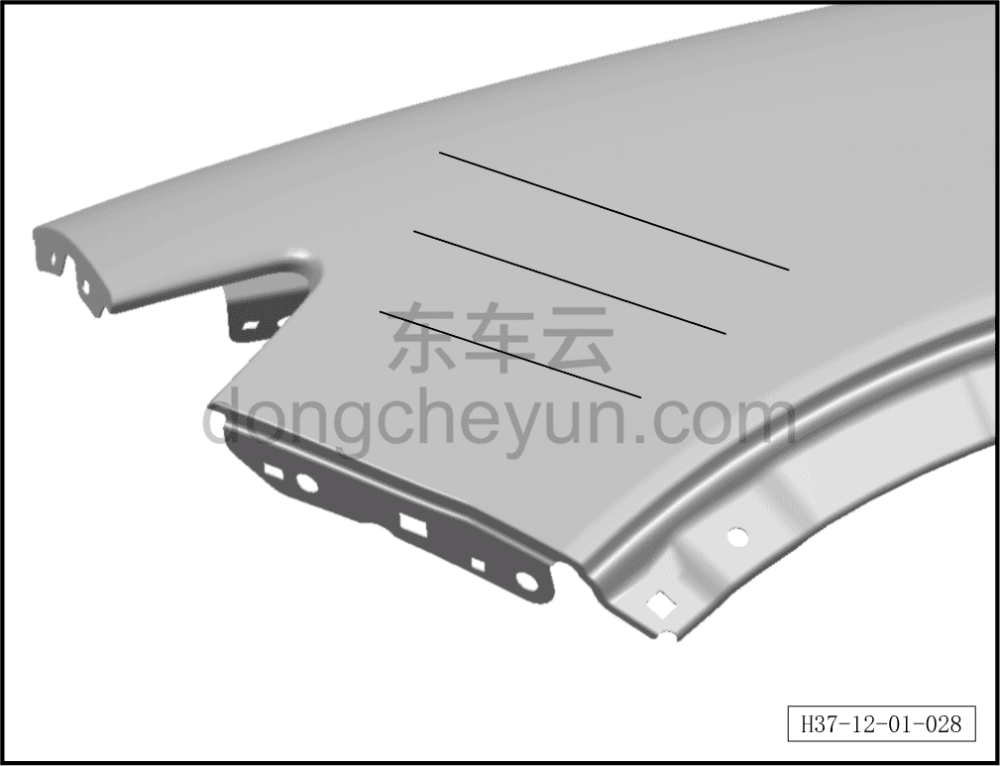

1. Царапина на крыле достаточно серьёзная, применяется технология локальной окраски (подкраса).

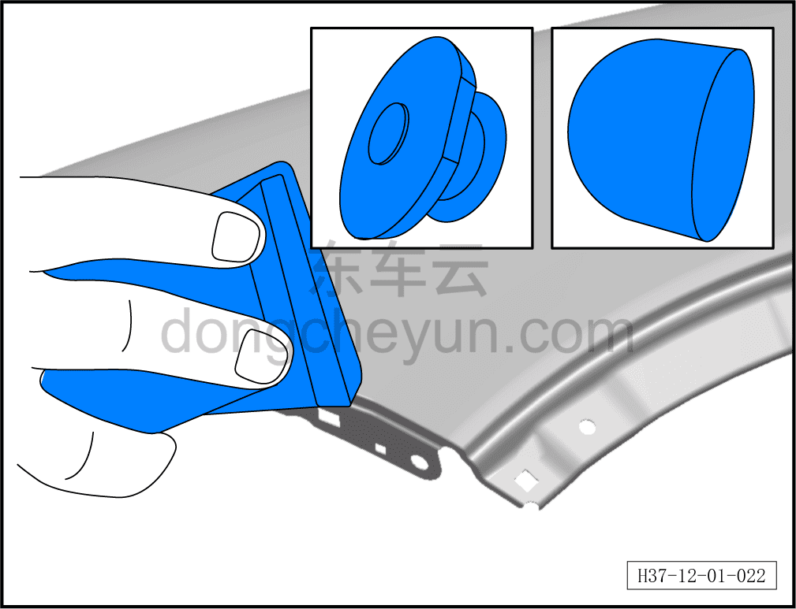

2. Обработайте повреждённую поверхность покрытия влажной (водостойкой) наждачной бумагой P500 (круговое шлифование).

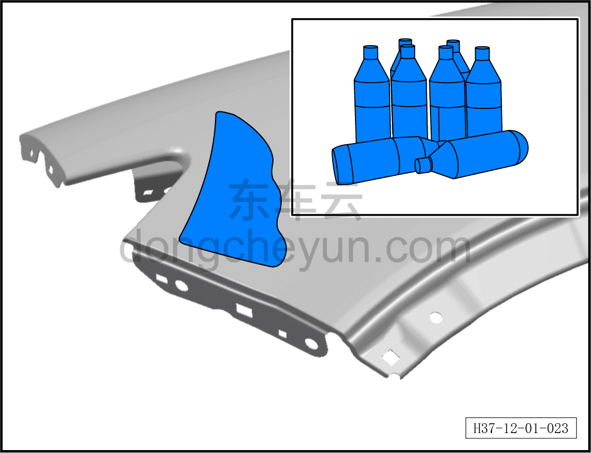

3. После завершения шлифования обезжирьте и очистите поверхность обезжиривающим средством.

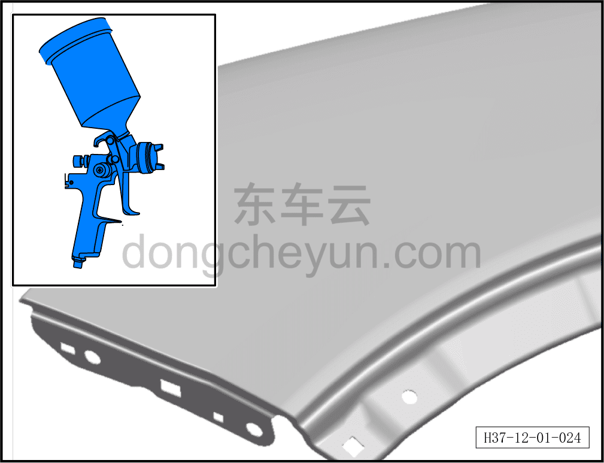

4. Нанесите промежуточный слой грунта, максимально ограничивая площадь нанесения грунта; в краевых зонах слой должен переходить плавно, без образования ступеньки.

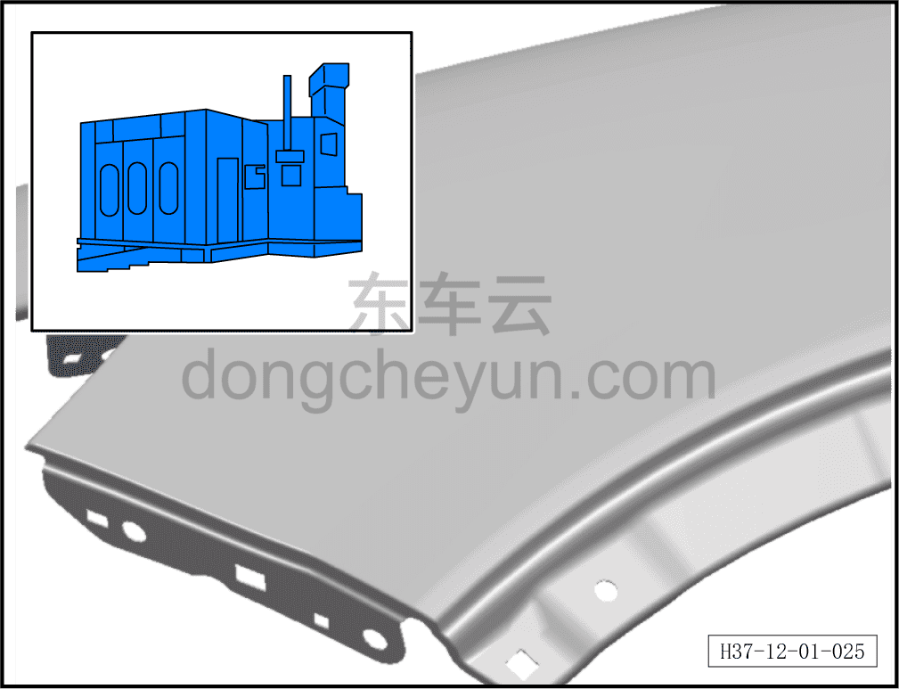

5. Выдержите на воздухе (4–5) мин, затем выполните сушку (20–30) мин. Температура в камере для сушки установлена на (70–80) °C / (158–176) °F.

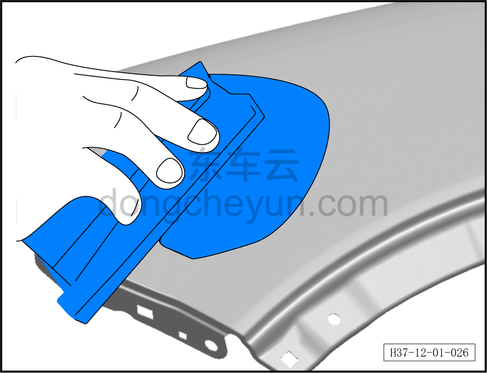

6. После сушки выполните мокрое шлифование наждачной бумагой (P800–1000).

7. Выполните шлифование мелкой водостойкой наждачной бумагой P2000, расширяя зону шлифования.

8. После завершения шлифования выполните обеспыливание перед окраской липкой марлей.

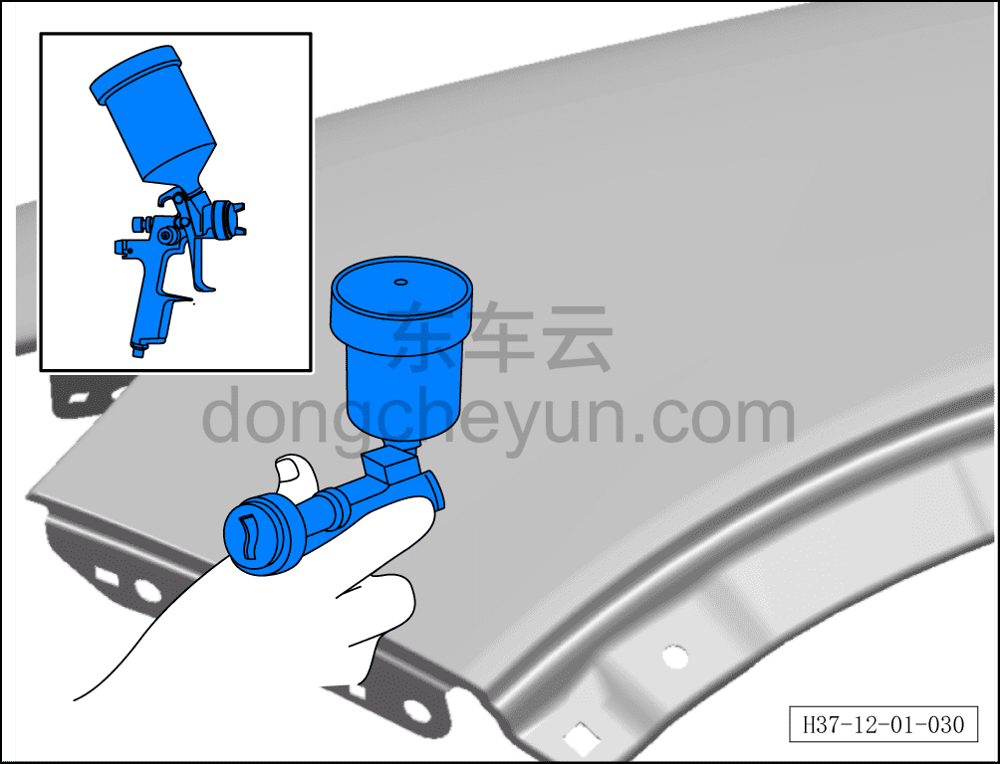

9. Нанесите базовый (цветной) слой краски.

a. Установите давление воздуха (150–200) кПа / (21,8–29,0) psi.

b. Расстояние распыления (20–30) см / (7,87–11,81) дюйм.

**Внимание:**

**- Каждый последующий слой распыления должен быть немного шире предыдущего для создания плавного перехода.**

10. После выдержки на воздухе (2–3) мин нанесите второй слой базовой краски, до тех пор, пока граница перехода не станет незаметной. Давление воздуха установлено на (150–200) кПа / (21,8–29,0) psi. Расстояние распыления (20–30) см / (7,87–11,81) дюйм.

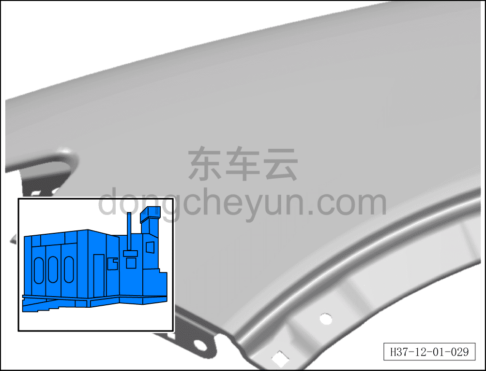

11. Выдержите на воздухе (4–5) мин, затем выполните сушку (20–30) мин. Температура в камере для сушки установлена на (70–80) °C / (158–176) °F.

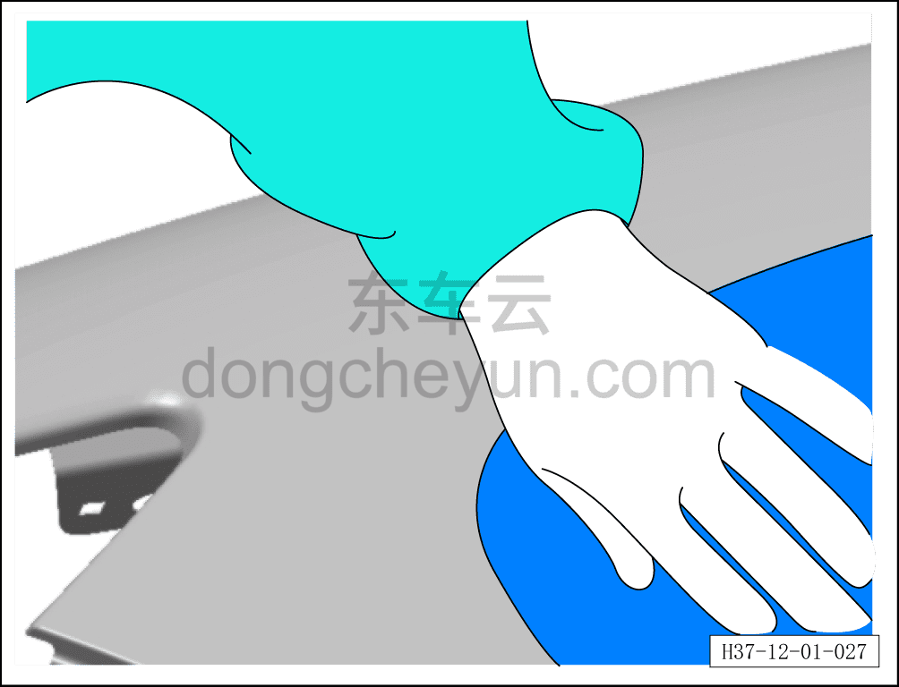

12. После сушки выполните обеспыливание липкой марлей перед нанесением прозрачного лака.

13. Нанесите прозрачный лак, зона нанесения должна полностью перекрывать зону базового цветного слоя. Давление воздуха установлено на (150–200) кПа / (21,8–29,0) psi. Расстояние распыления (20–30) см / (7,87–11,81) дюйм.

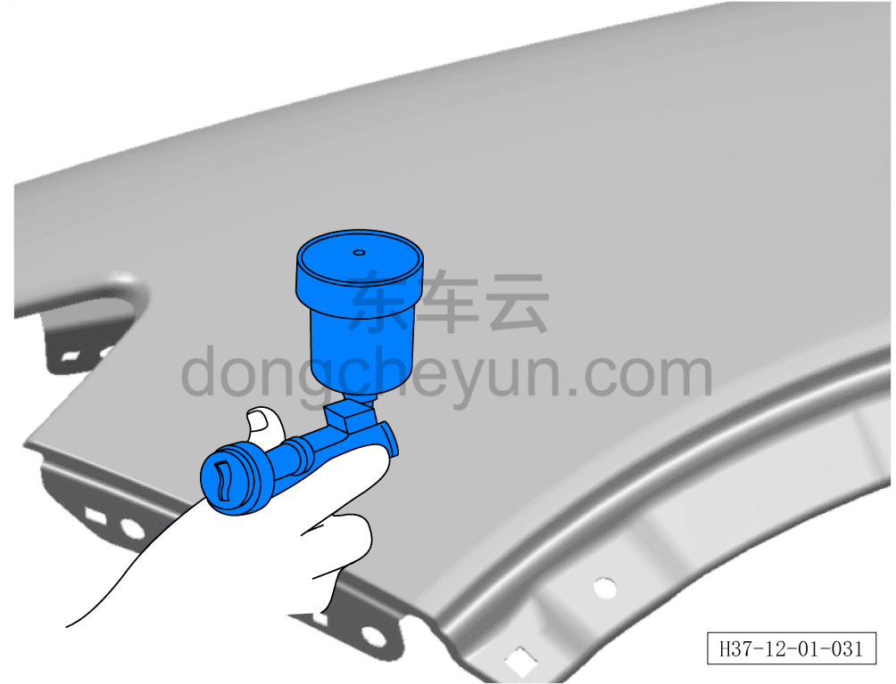

14. После выдержки на воздухе (2–3) мин нанесите второй слой прозрачного лака, зона нанесения должна полностью перекрывать зону первого слоя прозрачного лака. Давление воздуха установлено на (150–200) кПа / (21,8–29,0) psi. Расстояние распыления (20–30) см / (7,87–11,81) дюйм.

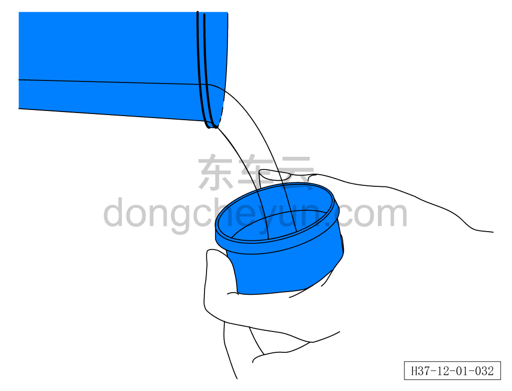

15. После завершения нанесения прозрачного лака немедленно добавьте в оставшийся прозрачный лак добавку для перехода границ или разбавитель.

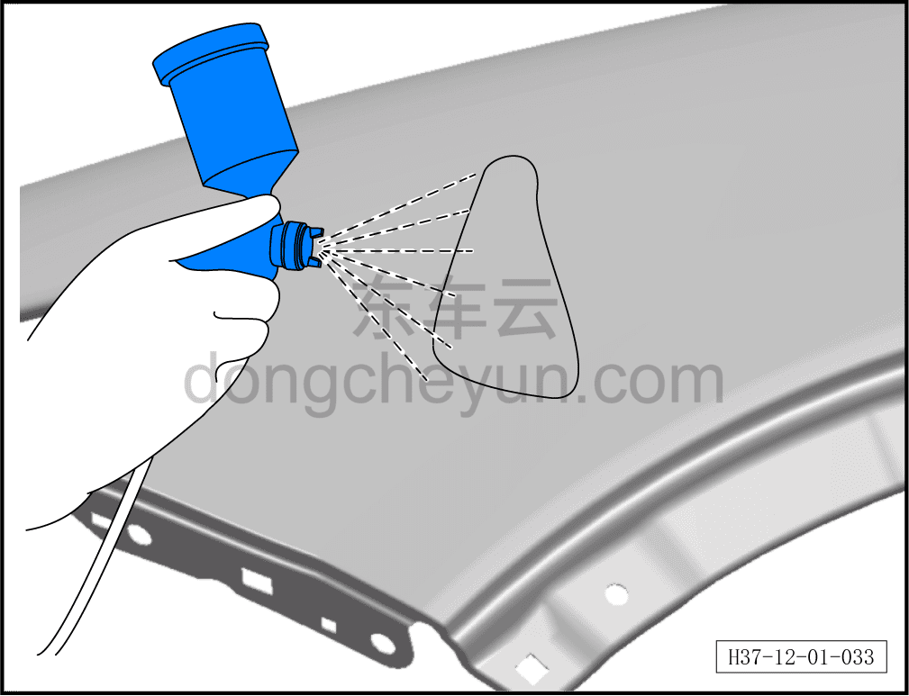

16. Нанесите (2–3) слоя разбавленного прозрачного лака в зоне перехода.

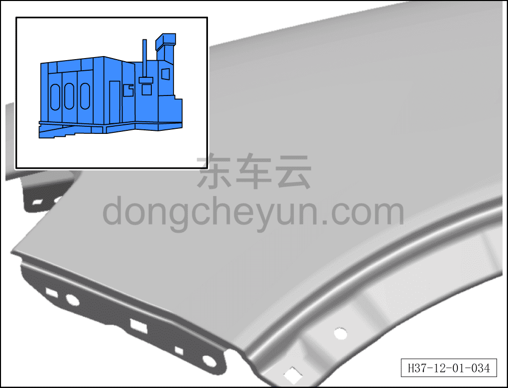

17. Выполните сушку в камере (20–30) мин. Температура в камере для сушки установлена на (70–80) °C / (158–176) °F.
