# Установка развлекательного экрана в подголовник «Сянь Мэн»

> Технология установки дополнительного и модифицирующего оборудования  
> Оригинал: `纤梦头枕娱乐屏加装` · [dongcheyun 56746](https://dongcheyun.com/p/56746), страница `0c6b3e1cb8a743e6b6f735b3eefb07b0` · [оглавление](../README.md)

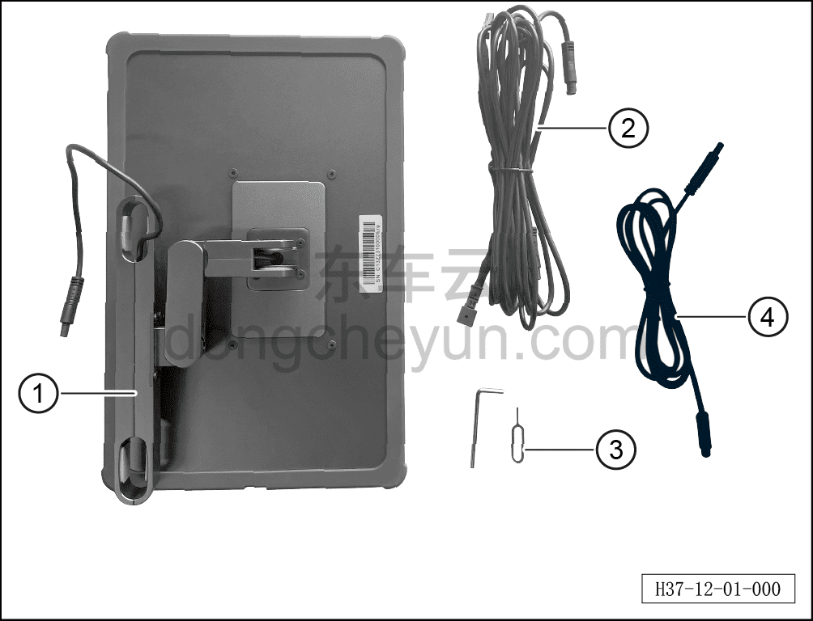

**Комплектация набора аксессуаров**

①: Развлекательный экран в подголовнике «Сянь Мэн»

②: Жгут проводов развлекательного экрана (основной)

③: Инструмент, входящий в комплект установки

④: Жгут проводов развлекательного экрана (входит в комплект экрана)

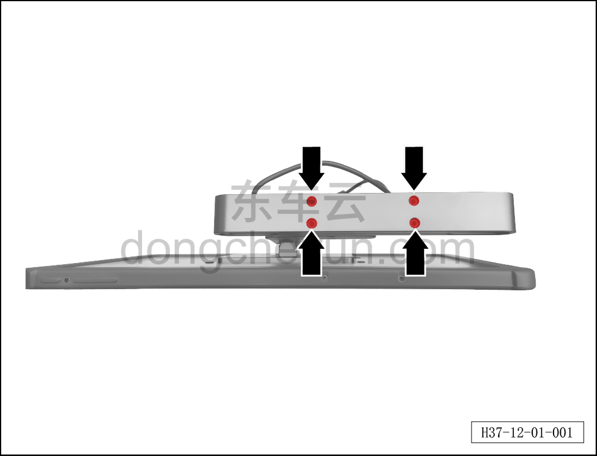

**Порядок установки**

1. Отсоедините минусовую клемму аккумуляторной батареи. См. [3.1.4.1 Обесточивание автомобиля](../03-техническое-обслуживание/005-обесточивание-автомобиля.md)

2. Снимите передний подголовник. См. [8.1.3.2 Снятие и установка переднего подголовника](../08-внутренняя-и-внешняя-отделка/004-снятие-и-установка-переднего-подголовника.md)

3. Снимите спинку переднего сиденья (панель). См. [8.1.3.12 Снятие и установка спинки сиденья (панели)](../08-внутренняя-и-внешняя-отделка/014-снятие-и-установка-задней-панели-сиденья.md)

4. Откройте набор с развлекательным экраном, извлеките развлекательный экран, используя инструмент из набора ослабьте 4 крепёжных болта кронштейна развлекательного экрана.

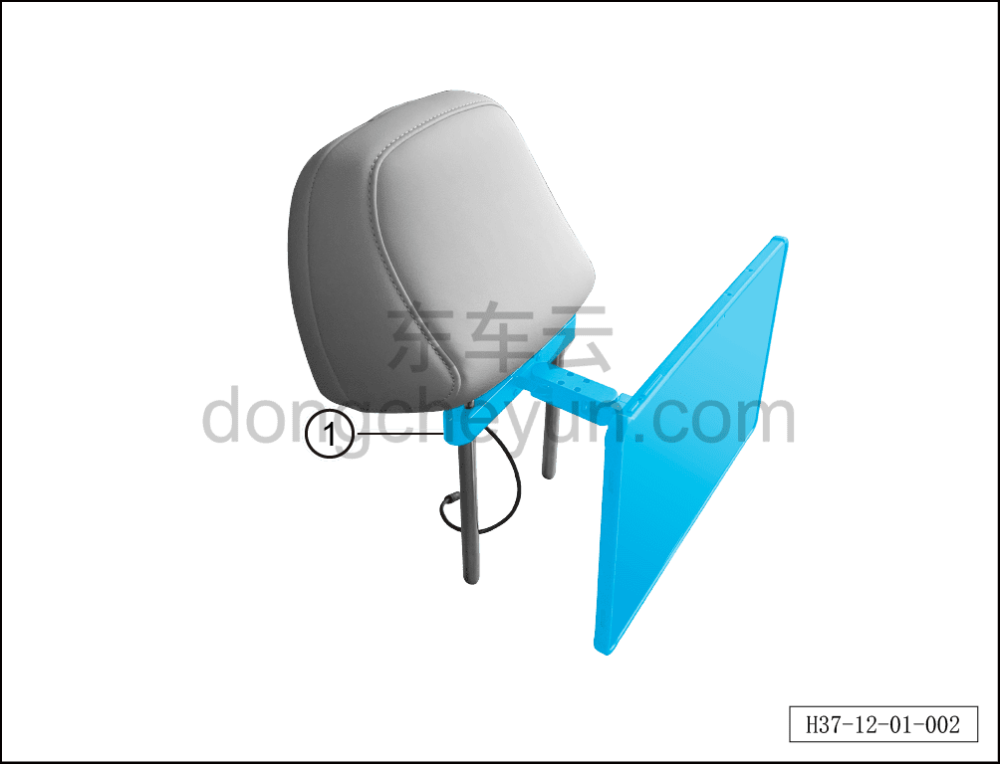

5. Наденьте развлекательный экран с кронштейном① на подголовник сиденья.

**Внимание:**

**- При надевании развлекательного экрана на подголовник сиденья обратите внимание на направление установки экрана: сторона экрана с кнопками должна быть направлена вверх.**

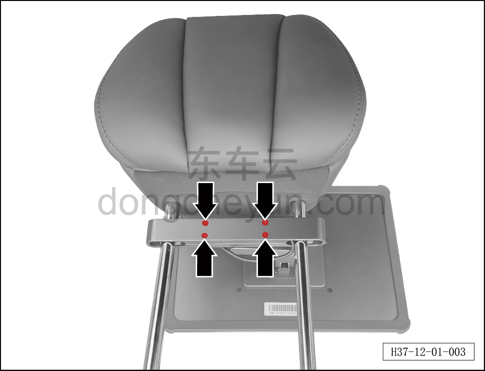

6. Убедившись, что направление установки экрана правильное, отрегулируйте высоту кронштейна так, чтобы он находился в положении между нижней частью подголовника и самым верхним пазом направляющего стержня подголовника, затяните 4 крепёжных болта кронштейна.

**Внимание:**

**- Развлекательный экран следует размещать на мягкой подкладке, чтобы не повредить экран.**

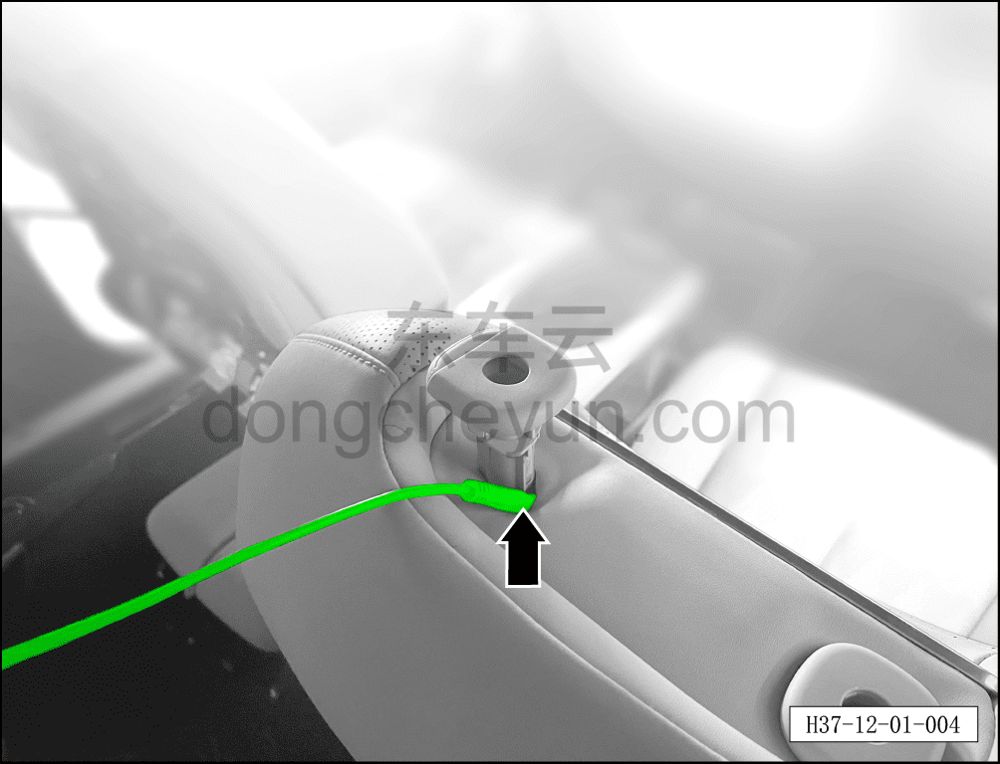

7. Снимите направляющую втулку подголовника, пропустите жгут проводов развлекательного экрана через направляющую втулку подголовника сиденья.

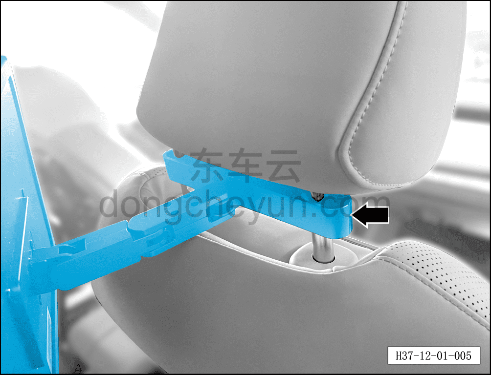

8. Установите направляющую втулку подголовника, установите подголовник и развлекательный экран на сиденье, проверьте надёжность крепления подголовника и экрана, а также нормальную работу функции регулировки.

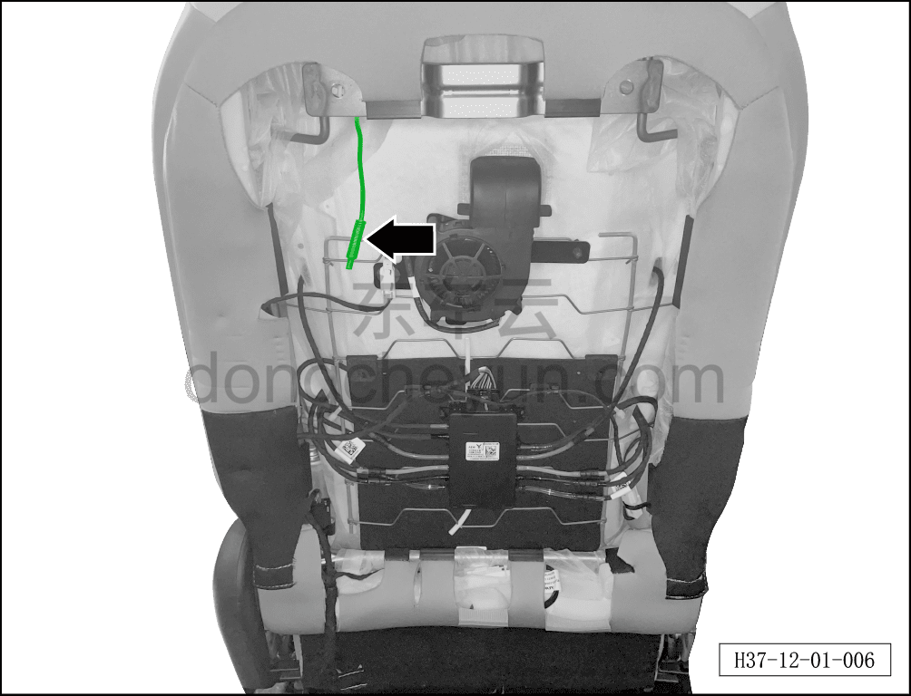

9. Извлеките разъём жгута проводов развлекательного экрана из спинки сиденья (панели).

**Внимание:**

**- Тем же способом установите подголовник и развлекательный экран с другой стороны.**

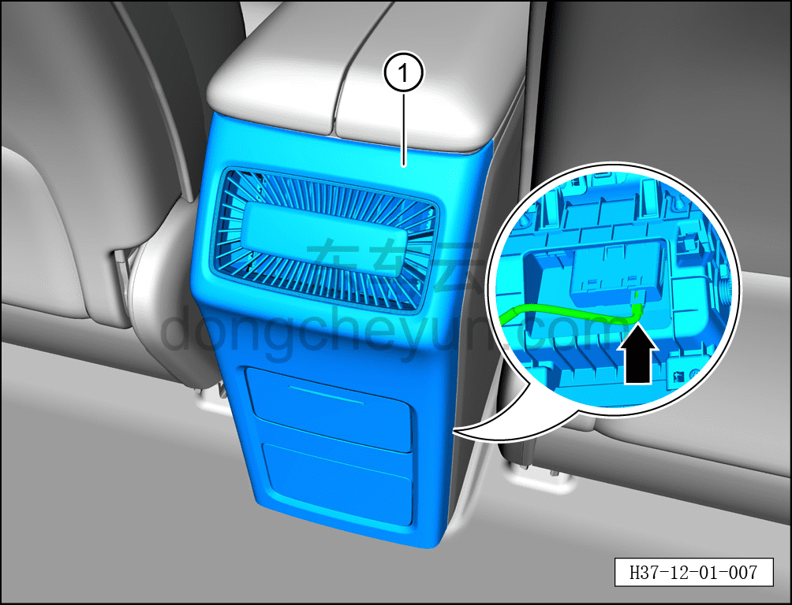

10. Используя инструмент для снятия элементов интерьера, отсоедините крепёжные клипсы задней крышки①.

**Примечание:**

**- К задней крышке подключён жгут проводов; при отсоединении не тяните с усилием, чтобы не повредить жгут проводов.**

11. Отсоедините разъём жгута проводов USB-зарядного устройства, снимите заднюю крышку①.

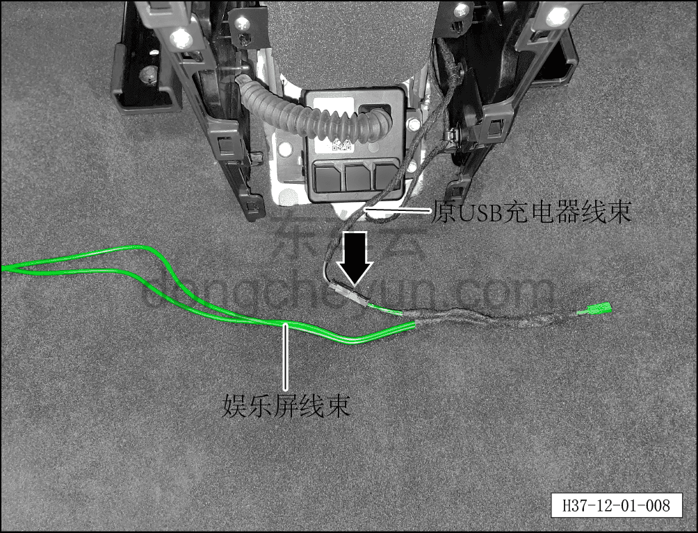

12. Соедините разъём жгута проводов развлекательного экрана из набора с разъёмом жгута проводов исходного USB-зарядного устройства.

**Примечание:**

**- После соединения разъёмов можно подключить развлекательный экран, чтобы проверить его нормальную работу.**

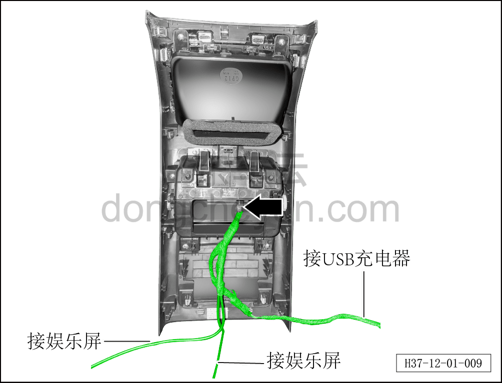

13. Установите разъём USB-зарядного устройства, пока не услышите щелчок, означающий, что он установлен на место.

14. Уложив жгут проводов развлекательного экрана, установите заднюю крышку.

**Примечание:**

**- Жгуты проводов левого и правого развлекательных экранов имеют одинаковую спецификацию, различать левый и правый жгуты проводов экрана не требуется.**

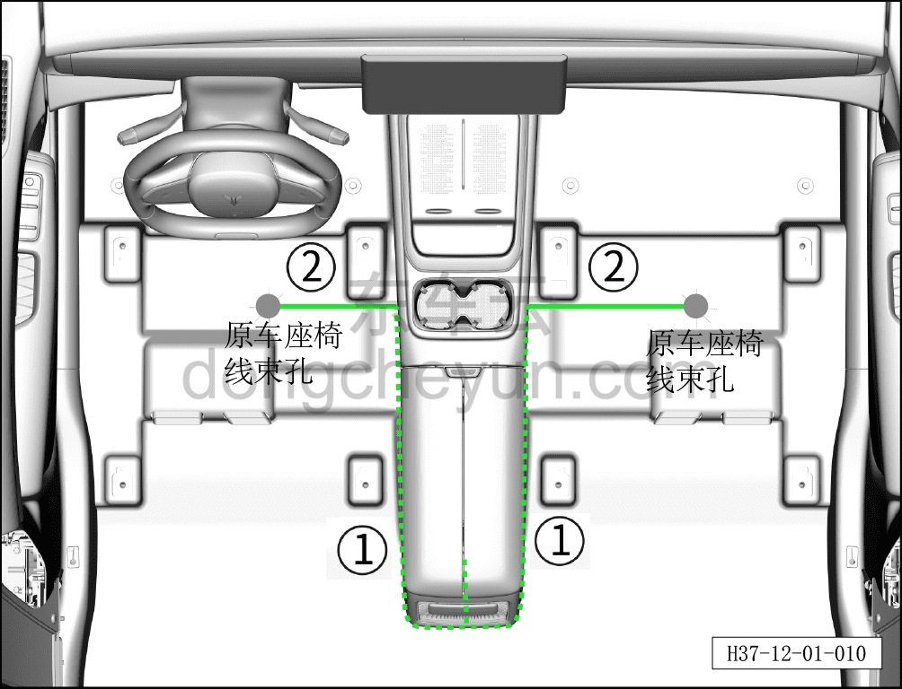

15. Скрытно проложите жгут проводов развлекательного экрана в соответствии с направлением, показанным на рисунке:

Участок① — скрытая прокладка, используя лопатку для снятия элементов интерьера, спрятать жгут проводов развлекательного экрана внутрь центральной консоли.

Участок② — открытая прокладка, используя липучку по цвету, близкому к цвету коврового покрытия, закрепите жгут проводов у штатного отверстия для жгута проводов сиденья.

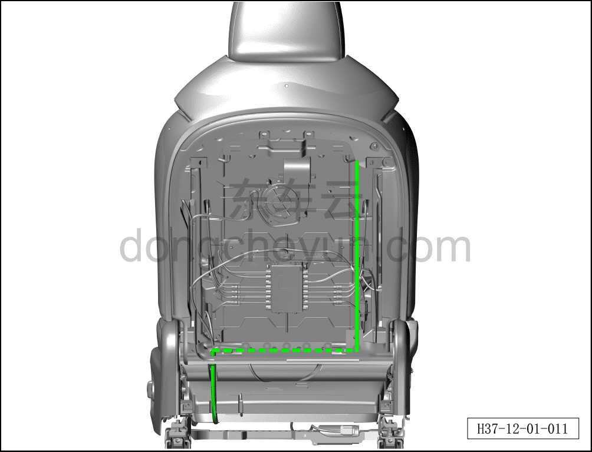

16. Закрепите жгут проводов развлекательного экрана вдоль жгута проводов электродвигателя основания сиденья, заведите жгут проводов в зазор поролоновой подушки сиденья для фиксации, пропустите его к внутренней стороне сиденья (вдоль штатного жгута проводов сиденья к внутренней стороне сиденья).

**Внимание:**

**- Если в процессе прокладки жгут проводов развлекательного экрана невозможно закрепить, необходимо использовать стяжки для фиксации жгута проводов, чтобы избежать протирания жгута проводов во время движения автомобиля, которое может привести к короткому замыканию и неисправности развлекательного экрана.**

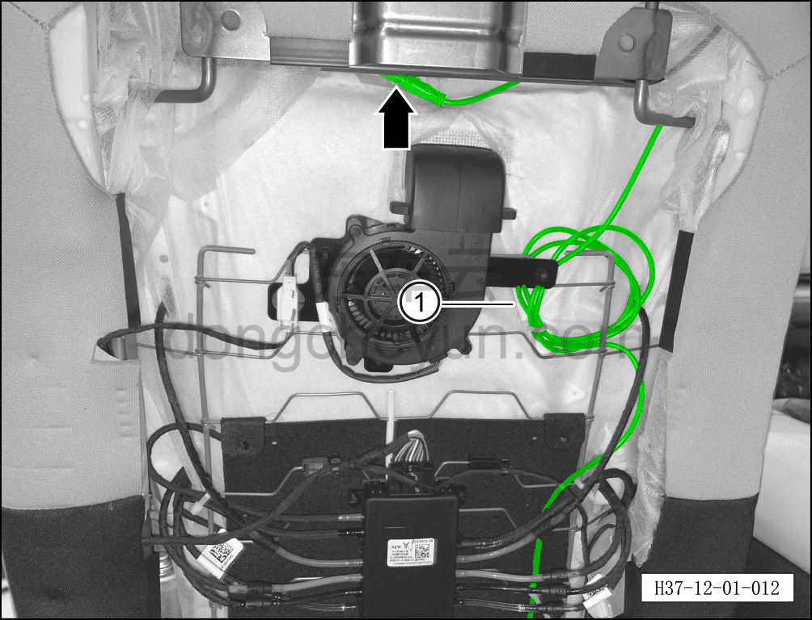

17. Соедините жгут проводов, входящий в комплект экрана, с разъёмом основного жгута проводов развлекательного экрана и обмотайте изоляционной лентой, чтобы избежать отсоединения.

18. Оставьте определённый запас жгута проводов (для удобства последующего обслуживания), излишек жгута проводов① свяжите стяжками и закрепите на кронштейне.

**Внимание:**

**- После завершения фиксации жгута проводов проверьте надёжность крепления всего жгута проводов развлекательного экрана.**

**- Категорически запрещается напрямую подключать развлекательный экран к основному жгуту проводов; прямое подключение приведёт к повреждению развлекательного экрана — подключение развлекательного экрана к основному жгуту проводов должно выполняться только через жгут проводов, входящий в комплект экрана.**

19. Установите спинку переднего сиденья (панель). См. [8.1.3.12 Снятие и установка спинки сиденья (панели)](../08-внутренняя-и-внешняя-отделка/014-снятие-и-установка-задней-панели-сиденья.md)

**Внимание:**

**- После завершения установки развлекательного экрана запустите автомобиль, проверьте отсутствие кодов неисправностей на приборной панели, нормальную работу автомобиля и нормальную работу функций развлекательного экрана.**
