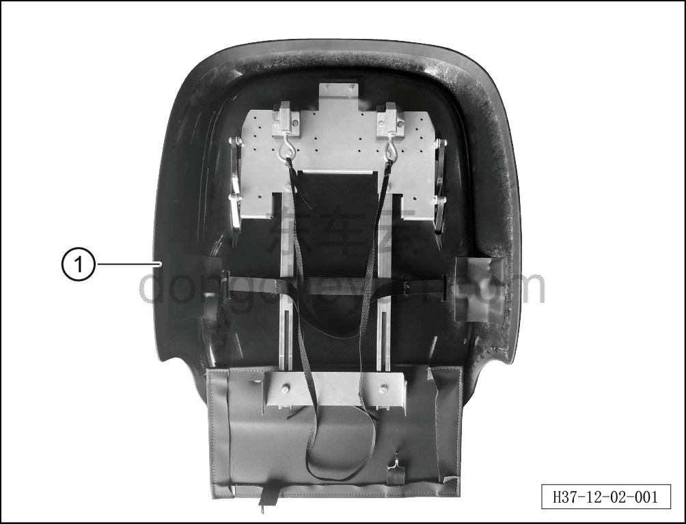
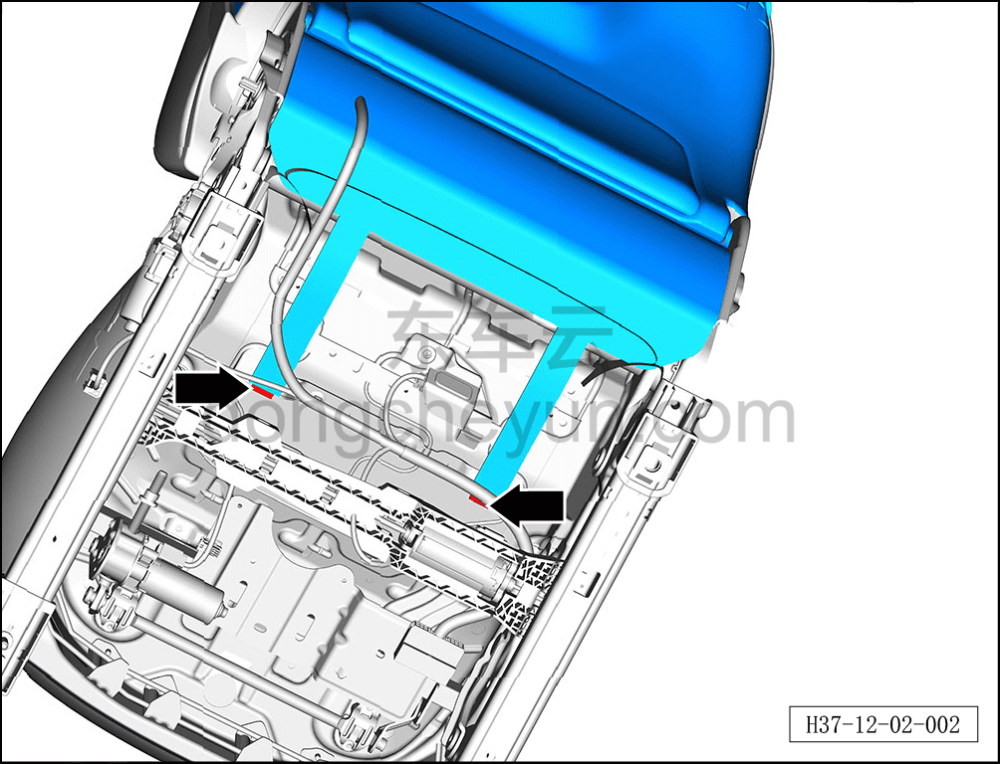
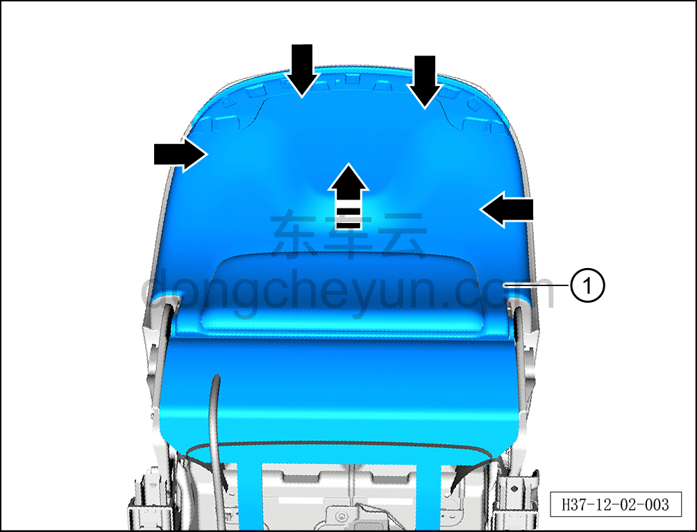
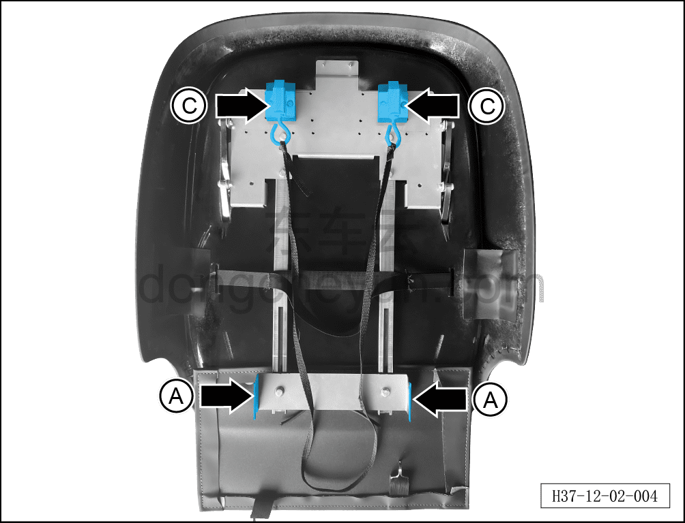
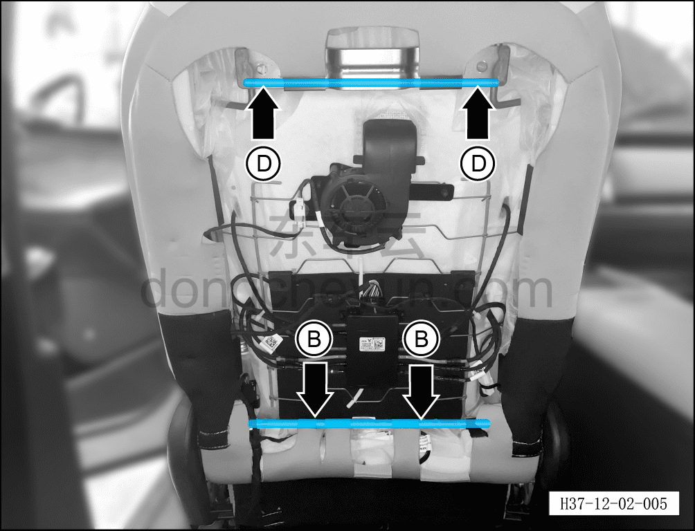
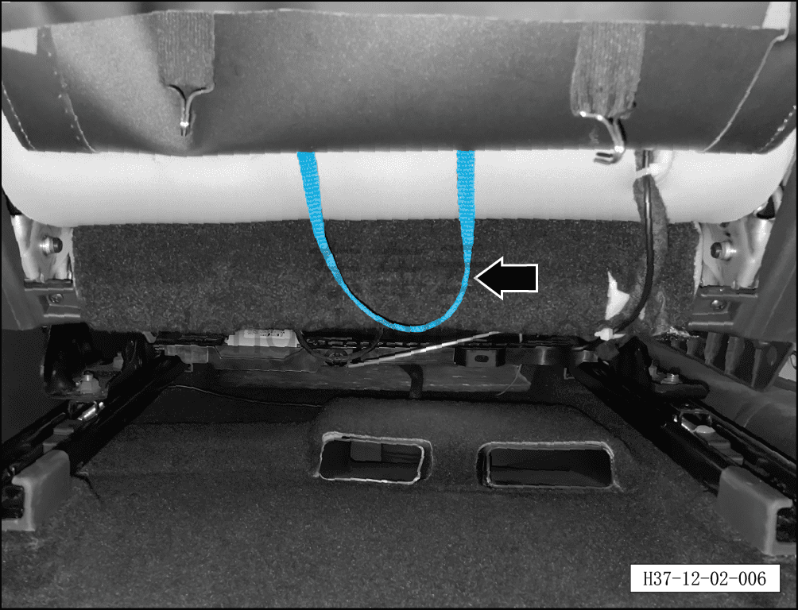
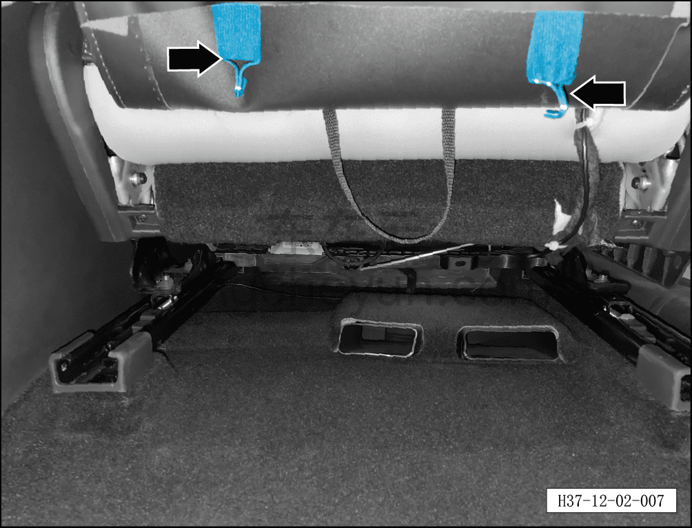
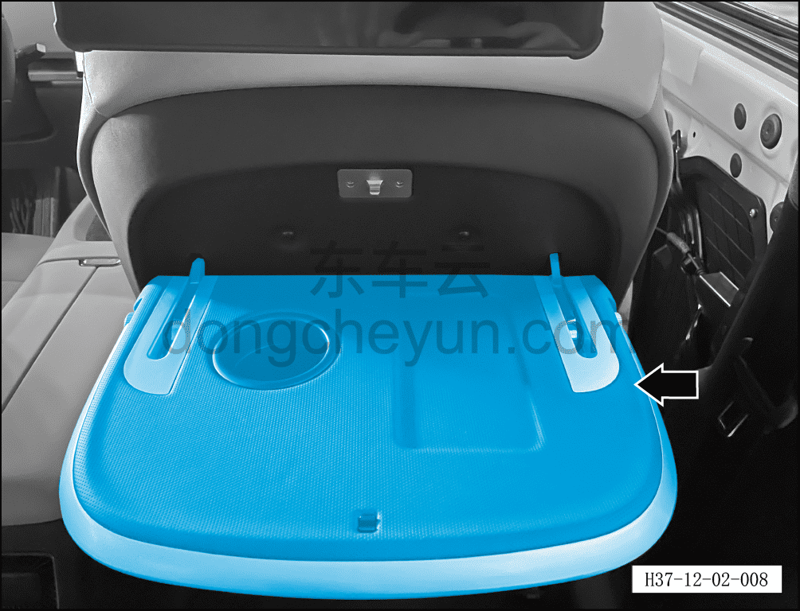

# Установка малого откидного столика

> Технология установки дополнительного и модифицирующего оборудования  
> Оригинал: `小桌板加装` · [dongcheyun 56746](https://dongcheyun.com/p/56746), страница `6784f62ca3f94947bc11a257135ee489` · [оглавление](../README.md)

**Комплектация набора аксессуаров**

①: Малый откидной столик в сборе

**Порядок установки**

1. Отсоедините минусовую клемму аккумуляторной батареи. См. [3.1.4.1 Обесточивание автомобиля](../03-техническое-обслуживание/005-обесточивание-автомобиля.md)

2. Снимите штатную спинку сиденья (панель).

a. Используя инструмент для снятия элементов интерьера, отсоедините 2 крючка спинки сиденья (панели).

b. Используя инструмент для снятия элементов интерьера, отсоедините 4 крепёжные защёлки спинки сиденья (панели), снимите спинку сиденья со столиком① в направлении стрелки.

**Внимание:**

**- Крепёжные защёлки спинки сиденья со столиком довольно тугие, при снятии действуйте осторожно, чтобы не повредить крепёжные защёлки спинки сиденья со столиком.**

3. Установите малый откидной столик (аксессуар).

a. Совместите паз крепления A малого откидного столика (аксессуара) с поперечным плечом B кронштейна сиденья, установите малый откидной столик так, чтобы язычок замка малого столика C зафиксировался на поперечном плече D кронштейна сиденья.

**Примечание:**

**- Паз крепления A малого откидного столика (аксессуара) имеет 2 фиксирующих паза; после установки отрегулируйте степень затяжки столика.**

b. Если после установки требуется снять спинку сиденья (панель), потяните за спинку сиденья, чтобы разблокировать язычок замка столика — после этого спинку сиденья (панель) можно снять.

c. Установите 2 крючка малого откидного столика (аксессуара) в места установки крючков штатной спинки сиденья (панели).

d. Откройте столик и проверьте нормальную работу функции открывания и закрывания столика.

**Примечание:**

**- После завершения установки проверьте надёжность крепления малого откидного столика.**
